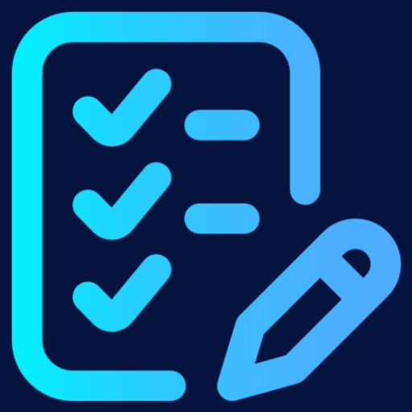
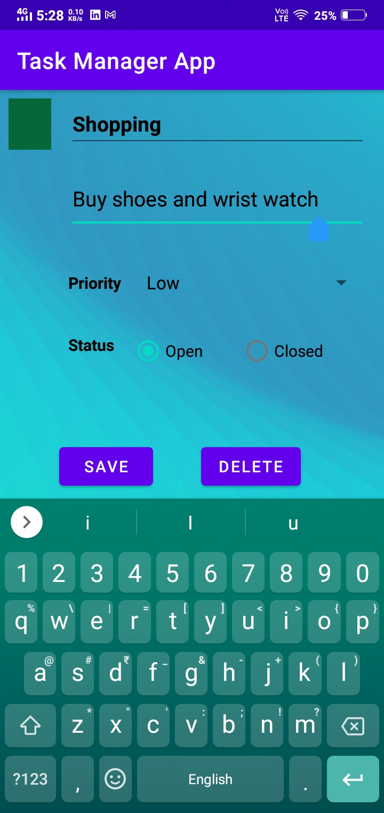
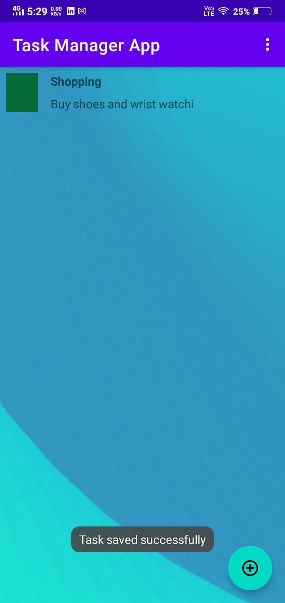
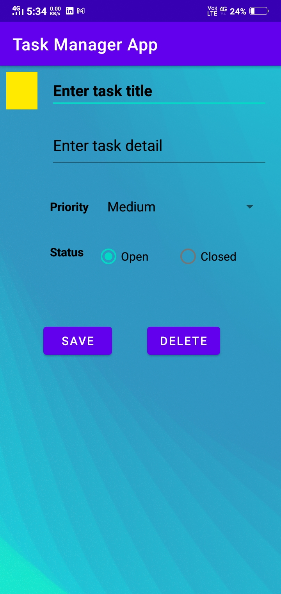
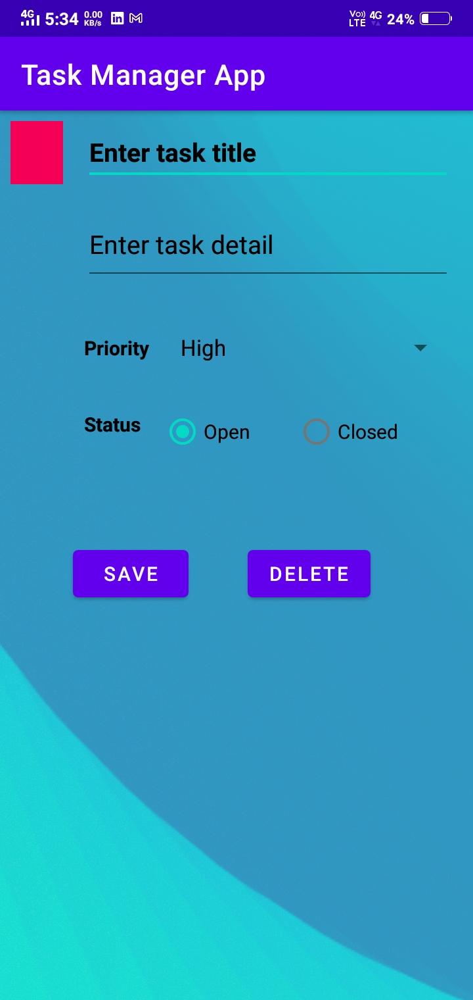
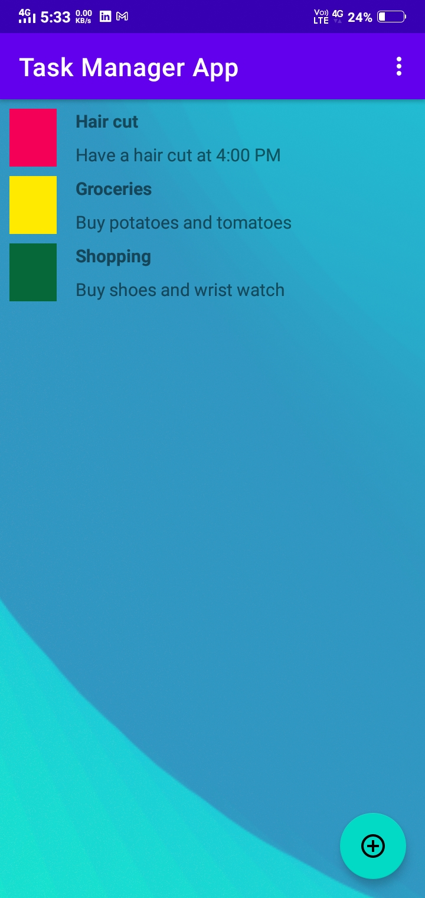
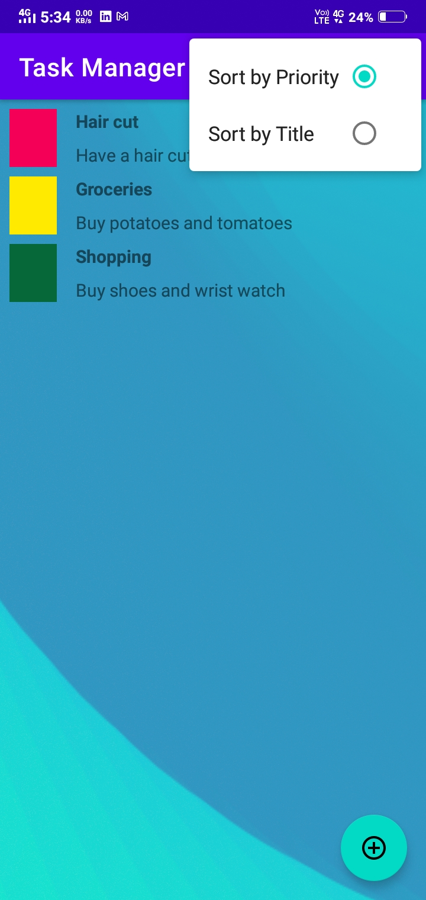
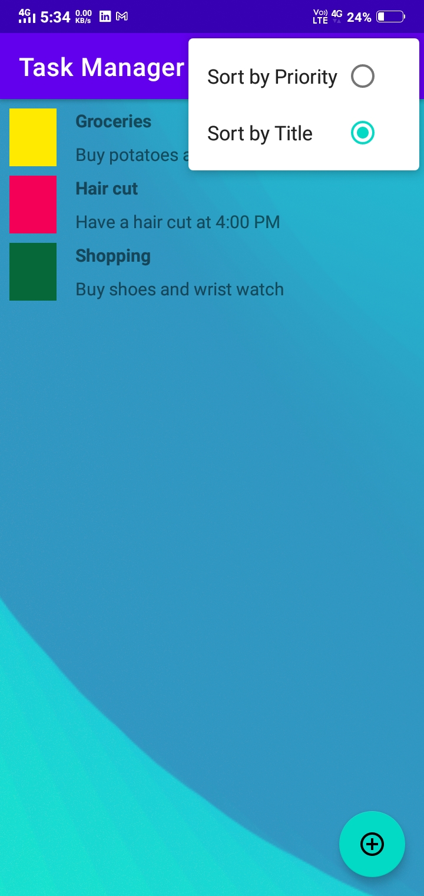
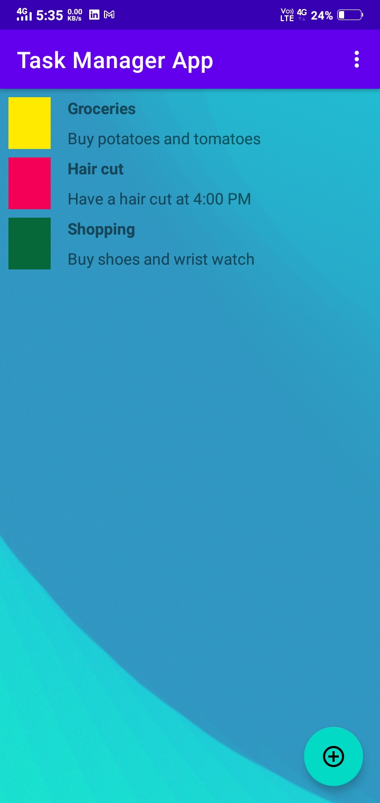

  

### Task-Manager-Application

 A simple android app written in Kotlin to manage tasks and modify them dynamically.

---

## **Problem Statement**

People often feel overwhelmed by the amount of work they have to do. They miss deadlines and, on occasion, just forget to do crucial tasks. They need other people to chase them to get work done. Not prioritizing your work and tasks leads to an unorganized life. Technology, which has become an inseparable part of students' lives, offers a plethora of alternatives for making their lives easier and much more organized. Therefore, mobile applications can be leveraged to relatively assist people in a variety of ways.

## **Solution**

This project presents a "Task manager" where a person can keep track of all of his work. It has a feature that allows you to make a list and add a task to it, as well as give it a title. You can add as many tasks as you like. It also lets you to tag the items in the list. By keeping such a list, you ensure that your tasks are written down all in one place so you don't forget anything important. The task's priority can also be set.  And by prioritizing tasks, you plan the order in which you'll do them, so that you can tell what needs your immediate attention, and what you can leave until later. The status of the task can also be checked to see if it has been completed or not. The project scope is to help people to efficiently complete their work and become more organized and reliable person.

## **Screenshots**
  
  
  

## **Functionality & Concepts used**

The App has a very simple and interactive interface which helps a person to manage his basic tasks so that he/she can never miss an important task:

- `Constraint Layout` : All of the activities in the app uses a flexible constraint layout, which is easy to handle for different screen sizes.
- `Recyclerview` :  To present the list of different tasks we used the efficient recyclerview.
- `LiveData & Room Database` : We are also using LiveData to update & observe any changes in the Task List and update it to local databases using Room.
- `Navigation Component` : We have used Navigation Component Library to navigate through different fragments/screens.

## **Application Link & Future Scope**

1. We can implement alarm feature in future.
2. Notification feature can be implemented for a specific period of time.
3. Animation can be improved.

The app currently in the Alpha testing phase with a limited number of users. You can access the application: [Task Manager App](https://github.com/RISHI2303/Android-Study-Jams/releases/download/initial_publish/Task-Manager.apk).
